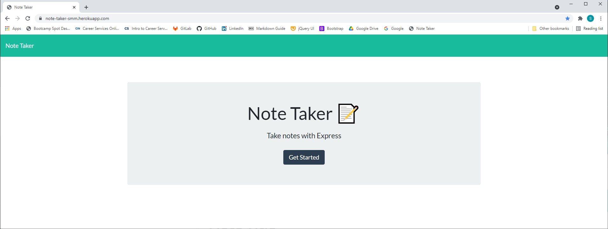

# Note Taker
Created by Shawn Miller

# Description
This app was created for a business or student to write and save notes. To accomplish this a user will need to follow the link below to run the app. At the title screen the screen the user will click on the "Get Started" button. From there a user will only need to click on the "Note Title" and type a note title. Below the title the user can enter a body of text. To save the note create the user will only need to click the disk button in the upper right part of the green task bar. The note will then appear on the left side of the screen. The user can then view it by clicking on the note title. If the user wants to delete the note they only need to click the red trash can next to the note title.

# Installation Instructions
This app can be used by clicking on the following link: https://note-taker-smm.herokuapp.com/

# Technologies Used
- Node.js
- NPM
- JavaScript
- Express.js
- HTML
- CSS
- JSON
- Bootstrap
- Heroku

# Appearance
## Title Page

## Note Page

# Known Bugs
No known bugs.

# Contact info
shawnsmm@gmail.com

github.com/Shawn52409

www.linkedin.com/in/shawn-miller-b44a36217